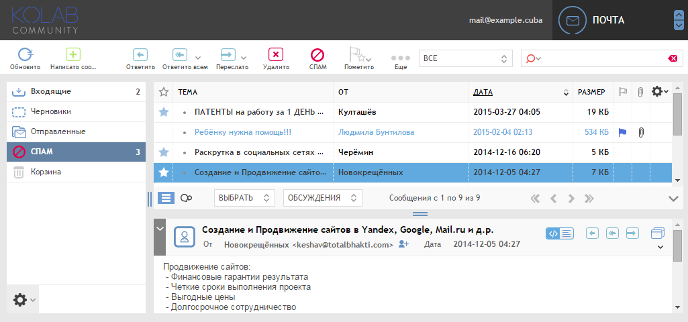
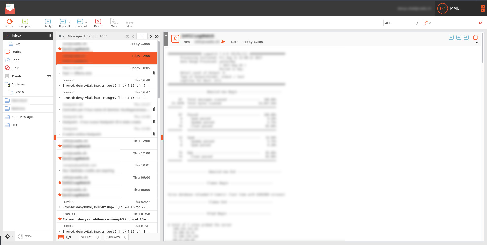

Chameleon Blue (roundcube skin)
===============================

Chameleon Blue basically is a blue customization of [Chameleon](https://git.kolab.org/diffusion/RSC/), also known as Kolab Enterprise Web Client Skin.

Installation
============

Merge "skins" folder with your Roundcube instance/skins directory.

**Chameleon depends on Larry, so this skin must be installed too.**

Kolab Enterprise Web Client Skin
================================

Screendesign and icons by [Kolab Systems AG, Zurich, Switzerland](http://kolabsys.com)
# Screenshots

# License
The contents of this folder can be redistributed and/or modified
under the terms of the GNU Affero General Public License as published
by the Free Software Foundation, either version 3 of the License,
or (at your option) any later version.

# Packaging and installation

styles.css is written using LESS syntax. Thus it needs to be compiled
using the `lessc` command line tool. This comes with the `nodejs-less`
RPM package which depends on nodejs.

 $ lessc -x skins/chameleon/styles.less > destination-directory/styles.css

(the -x option minifies the CSS code)

References to image files from the included CSS files can be appended
with cache-buster marks to avoid browser caching issues after updating.

Run `bin/updatecss.sh --dir <path-to-kolab-skin>` from the Roundcube
package before packaging the skin or after installing it on the
destination system.
